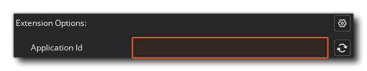

@title Getting Started

# Getting Started

> See also: [Discord Social Getting Started](https://discord.com/developers/docs/social-sdk/getting_started.html)

## Creating a Discord Application

The first step is to create a Discord application.

> See the Discord Social SDK docs at: [Step 1: Create a Discord application](https://discord.com/developers/docs/social-sdk/getting_started.html#autotoc_md28)

## Importing and Configuring The Extension

Download the latest release from the [Releases](https://github.com/YoYoGames/GMEXT-DiscordSocial/releases) page.

Import the `.yymps` package into your project and import the `DiscordSocial` folder. Make sure to also import the `ExtensionCore` folder; this extension is **required** by the Discord Social extension.

Next, set the application ID in the extension options to that of the application created above:



## Initialising The Extension

Before using the extension you need to initialise it:

```gml
discord_social_init();
```

Every frame, for example in the ${event.step}, call the ${function.discord_social_run_callbacks} function:

```gml
discord_social_run_callbacks();
```

When you are done using the Discord extension, free it by calling the ${function.discord_social_shutdown} function:

```gml
discord_social_shutdown();
```

## Usage Notes

### Extension Structure

The ${module.client} module is the entry point of the Discord Social extension. Functionality related to calls can be found under the ${module.call} module. The ${module.general} module contains documentation on all structs and constants of the extension as well as on the functions specific to the extension.

[[Note: All call functions take either the `channel_id` or the `lobby_id`.]]

### Extension Structs vs. Discord Social Classes and Objects

The extension functions return structs that represent the corresponding Discord Social SDK class. For example, the function ${function.discord_social_client_get_call} returns a GML struct of type ${struct.DiscordCall}, which correspond to the SDK's [`discordpp::Client::GetCall`](https://discord.com/developers/docs/social-sdk/classdiscordpp_1_1Client.html#a0bd43f93d0ca78d76d967317edfd0fb4) method of the `discordpp::Client` class and the [`discordpp::Call`](https://discord.com/developers/docs/social-sdk/classdiscordpp_1_1Call.html) class respectively.

While the Discord classes have methods to get and set the current value of properties, the structs returned by the extension functions don't have methods to get or set the value of the properties, they are pure data structs that contain all properties with their values at the time the struct is created. Depending on how you have set things up in your game it may be necessary to add logic to account for changes to struct members, as the values they hold can become outdated. For example, a message might be edited at a later time, which would be reflected in calls to the methods of [discordpp::MessageHandle](https://discord.com/developers/docs/social-sdk/classdiscordpp_1_1MessageHandle.html) objects. In GML, however, you will need to get a new ${struct.DiscordMessageHandle} struct that has updated values of all properties.

```gml
// Send a message and get the handle
message_handle = {};

discord_social_client_send_lobby_message(some_lobby_id, "Hello!", function(_result, _message_id) {
    message_handle = discord_social_client_get_message_handle(_message_id);
});

// 
discord_social_client_set_message_updated_callback(function(_message_id) {
    message_handle = discord_social_client_get_message_handle(_message_id);
});
```